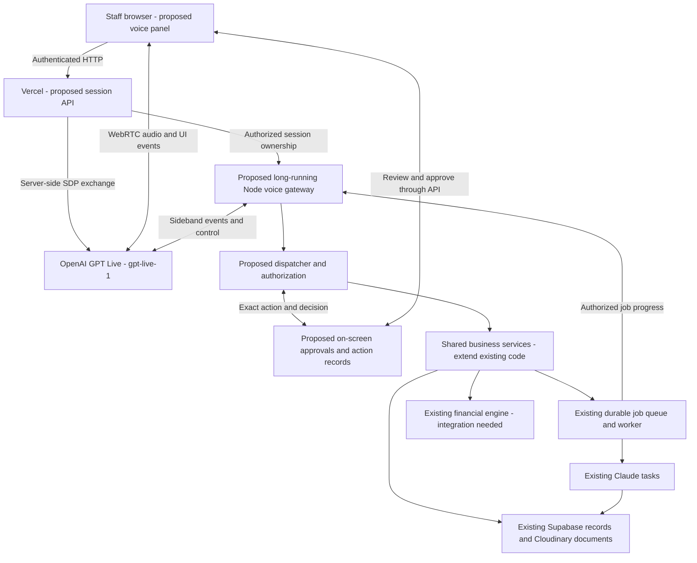
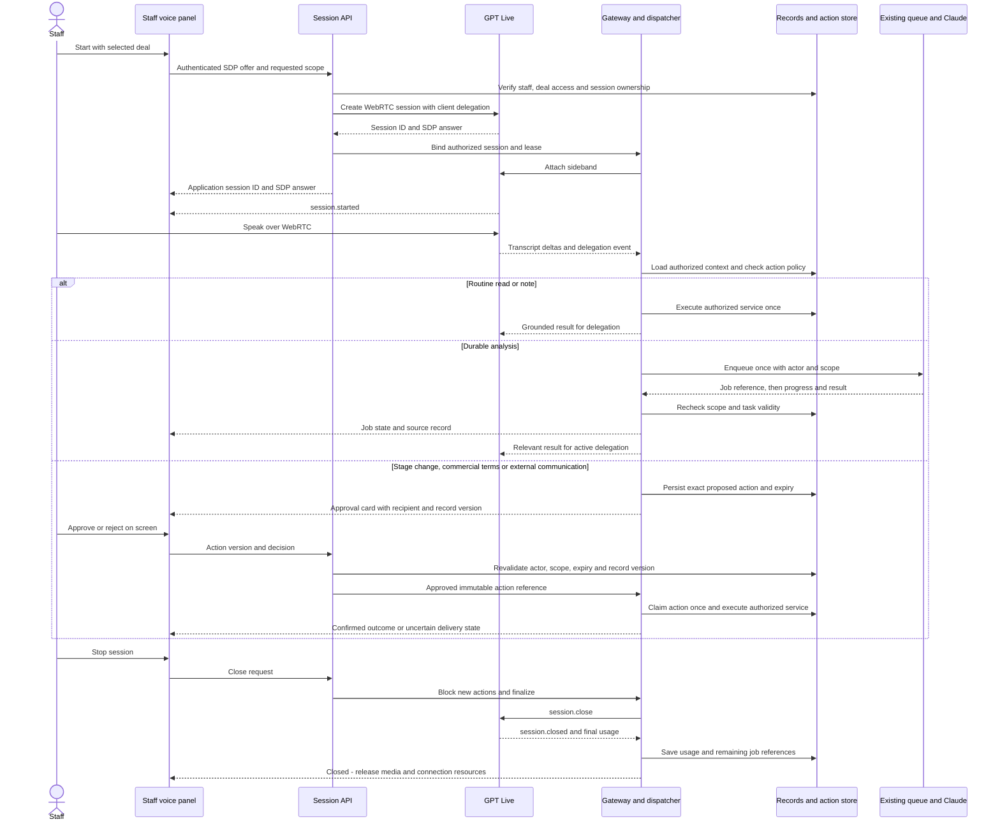

# GPT Live voice agents for ACP Deal Room

**Status: architecture proposal; no voice feature is implemented by this PR.**
This document adds no runtime code, dependencies, migrations, or deployment
changes. Repository findings and official API documentation were checked on
2026-09-19.

Recommend `gpt-live-1` for staff conversation, with an application-owned backend
that retains Claude analysis tasks, Supabase business records, deterministic
financial calculations, and the existing job queue. GPT Live supports full-duplex
voice and delegation to a backend; project-specific access remains unverified.
[GPT Live model documentation](https://developers.openai.com/api/docs/models/gpt-live-1).

The first release would serve authenticated internal browser users. Telephony,
customer-facing agents, and voice access for lender/shareholder portal accounts
are future extensions. Roll out behind a feature flag after verifying model
access in the deployment's OpenAI project.

## Existing capabilities and proposed workflow coverage

Every voice capability in this table is proposed. The linked code is the existing
foundation, not evidence of an implemented voice tool.

| Process                       | Proposed staff voice capability                                                                        | Existing foundation and integration boundary                                                                                                                                                                                                                                                                                      |
| ----------------------------- | ------------------------------------------------------------------------------------------------------ | --------------------------------------------------------------------------------------------------------------------------------------------------------------------------------------------------------------------------------------------------------------------------------------------------------------------------------- |
| Deal intake and pipeline      | Find opportunities, dictate intake, review next actions, propose stage changes.                        | [Deal API](../api/deals/index.ts), [repository](../lib/data/supabase/deals.ts), and [lifecycle service](../api/_services/deals.ts) support records and transitions with stage history and audit entries. Resolve company ambiguity before selecting or creating a record.                                                         |
| Call preparation              | Explain a deal, identify unknowns, generate a brief, answer questions, and rehearse a call.            | [Claude tasks](../lib/ai/tasks.ts), [deal detail UI](../src/pages/DealDetailPage.tsx), [personas](../src/lib/acp/personas.ts), and [scenarios](../src/lib/acp/scenarios.ts). Voice rehearsal and conversational routing still need implementation.                                                                                |
| Post-call processing          | Dictate a staff debrief, save notes, request analysis and a post-call brief, prepare follow-up drafts. | [Transcripts](../api/transcripts/index.ts), [manual notes](../src/components/deals/ManualNotesTab.tsx), and existing transcript/post-call jobs. Label staff recollections as debriefs; they are not recordings or verbatim transcripts of external calls. External-call recording requires a separate capture and consent design. |
| Documents and diligence       | Explain missing documents, summarize recorded risks, request document analysis and OSINT.              | [Checklist](../src/components/deals/DocumentChecklist.tsx), [extraction](../lib/documents/extract.ts), [authenticated downloads](../api/documents/download.ts), and [job handlers](../lib/jobs/handlers.ts). Authorize each document's deal relationship before retrieval.                                                        |
| Financials and structuring    | Explain ratios and evaluate scenarios using explicitly supplied assumptions.                           | [Deterministic engine](../lib/financial/engine/financial-engine.ts) exists, but [triggerFinancialAnalysis](../src/api/admin/ai.ts) throws “not available yet.” A validated service/job integration is prerequisite work; do not advertise this as an available workflow.                                                          |
| LOIs and email                | Prepare terms and correspondence for staff review.                                                     | [Deal composers](../src/pages/DealDetailPage.tsx) and [Make delivery handler](../api/webhooks/send-email.ts) exist. Resend delivery and automated email evaluations are proposed, not implemented. Reviewed delivery needs the controls below.                                                                                    |
| Lender/shareholder operations | Summarize assignments, submissions, and conversations; prepare communications.                         | [Assignments](../api/deal-assignments/index.ts), [submissions](../api/submissions/index.ts), [chat](../api/chats/index.ts), and [lender](../src/pages/LenderPortalPage.tsx)/[shareholder](../src/pages/ShareholderPortalPage.tsx) portals. The first voice release remains staff-only.                                            |
| Portfolio monitoring          | Give a portfolio briefing and explain alerts.                                                          | [Portfolio UI](../src/pages/PortCoMonitorPage.tsx), [summary API](../api/portfolio/summary.ts), and the portfolio-briefing handler use metrics, health records, and alerts. The current job reads across companies; define an authorized portfolio scope before exposing it.                                                      |
| HR and stakeholders           | Retrieve authorized records and prepare hiring briefs or stakeholder updates.                          | [HR UI](../src/pages/HrStakeholdersPage.tsx), [hiring briefs](../api/hiring-briefs/index.ts), and [people-manager roles](../api/_lib/authz.ts). Give these tools a separate authorization scope; general deal access must not imply HR access.                                                                                    |

The seven supported AI job types are `transcript-analysis`, `investment-verdict`,
`precall-brief`, `postcall-brief`, `portfolio-briefing`, `osint-scan`, and
`document-analysis`; see the [enqueue API](../api/ai/jobs.ts) and
[handlers](../lib/jobs/handlers.ts). [Claude task functions](../lib/ai/tasks.ts)
use [validated outputs with a repair retry](../lib/ai/client.ts). They are task
implementations, not an existing general-purpose agent framework.

Supabase “realtime” currently supports chat through the
[realtime-session endpoint](../api/auth/realtime-session.ts) and
[chat UI](../src/components/deals/DealChat.tsx). It does not provide voice media
or an OpenAI session.

## Recommended architecture

Solid connections below describe the proposed flow, not deployed infrastructure.
The voice panel, session API, gateway, dispatcher, and action store are new work.

Place a persistent voice panel in the existing
[staff layout](../src/components/layout/AppLayout.tsx): start/stop, microphone
mute, transcript, selected deal, job progress, and approval cards. Include links
to source records and explicit queued/failed/completed states. Users should still
be able to complete work through the existing interface when voice is unavailable.

Use WebRTC for browser audio. The browser creates an SDP offer; the trusted
server exchanges it with `POST /v1/live/sessions` and returns the answer. Keep
OpenAI credentials and session configuration server-side. Register event handlers
before connecting and wait for `session.started` before commands; the HTTP
creation starts the session.
[Official WebRTC guide](https://developers.openai.com/api/docs/guides/voice-webrtc?api=live).

Recommend a separately deployed, long-running Node service from this repository
to own each Live sideband connection and dispatcher. This is an architectural
choice, not an existing deployment. Keep Vercel for short HTTP operations and
[the queue](../lib/jobs/queue.ts) for durable analysis. Gateway restarts must
recover session/action ownership using a lease so two instances cannot execute
the same action. Expensive work must not depend on an open browser or socket.

### Proposed application interfaces

These are application contracts to design and implement, not existing routes or
OpenAI API paths. Use the verified user context from
[server authorization](../api/_lib/authz.ts), never client-supplied role headers.
All operations require ownership, current permissions, and request validation;
cookie-authenticated mutations also require origin/CSRF protection.

| Interface                                                 | Proposed contract                                                                                                                                                                                                                                                                |
| --------------------------------------------------------- | -------------------------------------------------------------------------------------------------------------------------------------------------------------------------------------------------------------------------------------------------------------------------------- |
| `POST /api/voice/sessions`                                | Accept SDP offer, requested deal ID and capability scope; validate staff identity and record access, create the provider session with client delegation, bind it to the gateway, and return an application session ID and SDP answer. Close the provider session if setup fails. |
| `GET /api/voice/sessions/:id`                             | Return only the owner's authorized session state, selected context, action summaries, and job references.                                                                                                                                                                        |
| `PATCH /api/voice/sessions/:id/context`                   | Validate a requested deal/scope change with an expected context version. Invalidate pending approvals and superseded work. For a different deal or HR scope, create a fresh provider conversation so old context cannot leak into the new scope.                                 |
| `POST /api/voice/sessions/:id/actions/:actionId/approval` | Record an explicit on-screen accept/reject decision for the immutable action version. Recheck authority and record version immediately before execution.                                                                                                                         |
| `POST /api/voice/sessions/:id/close`                      | Idempotently mark closing, prevent new actions, finalize provider usage, and release the gateway lease. Return outstanding durable job references.                                                                                                                               |

### Delegation and execution

Choose client delegation with `model: "gpt-live-1"` and
`delegation: { type: "client" }`. The backend selects and executes its own tools;
this lets ACP retain Claude. Collect transcript deltas with timing and use them
with authorized application context. `session.delegation.created` carries a
delegation ID and offset, not the user's utterance. Return concise results using
`session.commentary.append`, or quiet context through `session.thinking.append`,
with the original delegation ID. These appends accept up to 500 tokens. Do not
use the Responses-only `response.create` flow for client delegation.
[Official delegation guide](https://developers.openai.com/api/docs/guides/live-delegation).

Implement a dispatcher that resolves intent into a small, schema-validated tool
allowlist. Proposed tools include `find_deals`, `get_deal_context`, `save_note`,
`request_analysis`, `get_job_status`, `prepare_transition`, and
`prepare_correspondence`. Tool names do not grant authority. Derive the actor
from the session, authorize every record ID, and treat retrieved documents and
transcripts as data rather than permission-bearing instructions.

Reuse the lifecycle service and extract other business operations into shared
services used by HTTP handlers and voice tools. Do not expose arbitrary endpoint
calls, SQL, or repository patches. Routine authorized note-taking and analysis
can run without an approval card; read-only staff cannot gain write access through
voice. Return reads promptly. Analysis should return a job reference immediately,
then report persisted progress and results. An accepted job is not a completed
analysis, and a generated draft is not a sent message.

Ground answers in identified records and source timestamps. Ask the user to
resolve duplicate company names and uncertain numbers, including currency, units,
and reporting period. Do not silently convert missing financial data into facts.
For scenarios, show supplied assumptions separately from recorded values, run the
financial engine, and explain its incomplete/insufficient-data results faithfully.

### Session sequence

The sequence shows successful setup and approval; failed authorization or an
expired/rejected approval must stop execution. On stop, mute capture immediately,
then keep connections available for bounded finalization. A dropped connection
must leave finalization marked incomplete rather than inventing final usage.

## Authority, persistence, and reliability

Propose voice-session metadata linking application/provider session IDs, staff
user ID, scope and context version, gateway lease, lifecycle timestamps, and
usage. Propose action records linking session, delegation, actor, deal, tool,
validated input hash, idempotency key, approval ID/version/expiry, job ID, outcome,
and audit references. These require future schema work; they do not exist yet.

Reuse existing notes, selected transcripts, briefs, and audit records for business
content. Keep the conversation history needed for an active delegation in a
short-lived store with a defined retention period; save business notes and only
explicitly selected transcripts as durable content. Store no raw audio by default,
including reflected sideband audio or diagnostic logs. Provider retention settings
need review before rollout; this application default is not a claim about provider
retention. Redact secrets and restrict access to session diagnostics.

Require on-screen approval before executing external communications, stage
changes, or committing commercial terms. The card must show the exact action,
deal, recipient(s), subject/body or term values, attachments, source record
version, and expiry. A spoken “yes” alone is insufficient. Bind approval to an
immutable payload hash and consume it once; changed amounts, recipients,
attachments, record versions, or permissions require a new review. Use atomic
version checks and action claims, not a check followed by an unprotected write.

Assign the gateway sole execution ownership even when events also reach the
browser. Use durable idempotency keys for notes, jobs, transitions, and sends.
Correlate late results to the original scope and task generation; do not speak
old-deal results into a new session. Interrupting speech or muting audio must not
be interpreted as canceling work. An explicit cancel blocks uncommitted actions;
running jobs need cooperative cancellation support, which the current queue does
not expose as a complete voice cancellation contract. Report work that already
committed and suppress obsolete conversational results.

Keep tool execution and session control on the server. Close with `session.close`,
observe `session.closed`, and collect final usage before disconnecting. A sideband
supports server control while WebRTC carries audio, but application code must own
authorization, cancellation, and duplicate prevention.
[Official server-side controls](https://developers.openai.com/api/docs/guides/voice-server-controls?api=live).

### Prerequisites before enabling tools

Authenticated access alone is insufficient to turn existing endpoints into tools.
Resolve these gaps in future implementation PRs:

- **Job ownership and scope:** [status reads](../api/jobs/status.ts) require auth
  but do not check job ownership. [Enqueue](../api/ai/jobs.ts) checks writer role
  but accepts a generic payload. Validate per-job schemas and record/deal
  relationships, persist a stable actor ID and scope, and authorize enqueue,
  worker execution, status, cancellation, and result disclosure. Portfolio jobs
  need an explicit scope because they currently query across companies.
- **Role-policy consistency:** [server role groups](../api/_lib/authz.ts) and
  [frontend permissions](../src/lib/rbac.ts) differ. Generic
  [CRUD reads](../api/_lib/crud-route.ts) permit authenticated reads without a
  staff/deal-specific gate despite the helper's comment. Define and test one
  server-enforced capability policy, especially for HR and portal roles. UI
  visibility and model instructions are not security boundaries.
- **Delivery state and duplicate sends:** the [Make handler](../api/webhooks/send-email.ts)
  returns `delivered: true` on webhook success, although acceptance is not proof
  of final delivery. Add durable send identity, provider acknowledgment and
  delivery reconciliation, and distinguish prepared, approved, submitted,
  confirmed, failed, and uncertain states. Do not blindly retry an uncertain send.
  Its best-effort audit write is not a durable action ledger.
- **Consistent mutations:** add transactional/versioned stage and audit updates,
  replay-safe action execution, approval expiry, and durable failure reporting.
  A gateway reconnect must consult the action ledger before retrying work.
- **Financial integration:** implement validated inputs, units, provenance, and
  deterministic engine invocation before enabling scenario tools. Preserve the
  existing calculations and verify against their golden-number tests.

## Phased delivery and acceptance criteria

All phases below are future implementation. Run the shared release suite at each
phase, plus its workflow-specific cases. Pilot tools must pass their own
prerequisites before being enabled; expansion cannot bypass foundation controls.

| Phase                    | Scope and dependencies                                                                                                                                                                    | Additional acceptance cases                                                                                                                                                                                                                                                                                                                                                       |
| ------------------------ | ----------------------------------------------------------------------------------------------------------------------------------------------------------------------------------------- | --------------------------------------------------------------------------------------------------------------------------------------------------------------------------------------------------------------------------------------------------------------------------------------------------------------------------------------------------------------------------------- |
| 1. Foundation and pilot  | Session authorization, gateway, scoped dispatcher, action tracking, job ownership, and a single-deal assistant for grounded Q&A, notes, and existing analysis jobs.                       | Deny wrong-role/wrong-deal/forged-session requests; disambiguate company names; correct dictated amounts before saving; identify absent sources; deduplicate notes/jobs; handle interruption, cancel requests, late results, provider failure, microphone denial, and reconnect. Compare completed analysis with existing persisted job outputs. Keep high-impact tools disabled. |
| 2. Deal execution        | Intake, document diligence, financial-engine integration, reviewed transitions, and correspondence preparation. Enable sends only after delivery reconciliation and duplicate protection. | Verify exact amounts/units against [financial golden numbers](../lib/financial/calculations/calculations.test.ts); reject stale approvals and changed recipients; test concurrent record edits, duplicate send events, failed/uncertain sends, document access and malicious document instructions. Missing source data must remain visibly missing.                              |
| 3. Operational expansion | Authorized portfolio/relationship workflows, followed by separately authorized HR tools.                                                                                                  | Reject cross-company, portal-to-staff, and deal-to-HR access; test role revocation mid-session, corrected portfolio assumptions, missing reporting periods, scope switches with late results, and portfolio-job parity. Re-run approval and delivery tests for stakeholder communications.                                                                                        |

The shared release suite must cover wrong-role, wrong-deal, and forged-session
access; ambiguous names, corrections, and missing data; duplicate events,
interrupted speech, canceled tasks, and late results; expired approvals, changed
recipients, and failed/uncertain sends; provider failures, unavailable models,
microphone denial, and reconnect; and agreement with applicable existing financial
calculations and job outputs. In phase 1, attempts to invoke unavailable financial
or delivery tools must fail without side effects.

Require **zero unauthorized writes, approval bypasses, or cross-scope disclosures**
in the release suite. Duplicate-event tests must create one intended action.
Use recorded fixtures and provider mocks for reproducibility, then a controlled
staff pilot for audio and account-access checks. Agree measurable latency,
grounding, and completion targets before widening the feature flag.

Track task completion by workflow, grounded-answer accuracy against cited records,
p50/p95 speech and tool-response latency, duplicate actions, approval bypasses,
and cost per completed workflow. Correlate session/action/job IDs without putting
sensitive transcripts into general telemetry. Evaluate spoken summaries separately
from the underlying job results so accurate analysis is not undermined by an
incorrect verbal claim.

Published GPT Live voice pricing checked on 2026-09-19 is **$0.05/minute**, billed
per second; backend model/tool usage is additional. Track Claude, extraction,
queue/gateway, and other integration costs separately. Account-specific access
has not been verified. [Model pricing](https://developers.openai.com/api/docs/models/gpt-live-1).

A later implementation should verify current API/SDK contracts and pricing again,
prove project access, set session duration and spending limits, and rehearse the
feature-flag rollback. This documentation PR enables no voice functionality.
